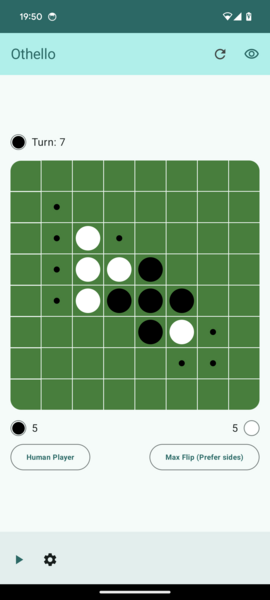

# Othello for Android

This is a sample app for the [hurok UDF framework](https://github.com/atomgomba/hurok) and a fully playable Othello game. Playing against the computer and human vs. human games are both supported. It also has a history view to see and analyze past game moves.

For a good example of how *hurok* is used, please have a look at the code for the [game history feature](https://github.com/atomgomba/othello/tree/main/feature/game-history); it's a bare-bones list of past game moves.

You can grab a ready-built APK from [GitHub Actions](https://github.com/atomgomba/othello/actions).

## Building locally

*hurok* is published using the GitHub Packages Maven registry. GPR requires authentication, so to build the app locally, you have to first create a classic access token in your GitHub [profile settings](https://github.com/settings/tokens). Once having a token, please set the `GPR_USERNAME` and `GPR_TOKEN` environment variables in the shell you are using to run the Gradle build.

## Changes

### v5

* Maintenance release

### v4

* Add basic baseline profiles

### v3

* Game history

### v2  

* Adaptive navigation

### v1

* First release

## License

This game is released under the Apache 2.0 license. Please see [LICENSE](https://raw.githubusercontent.com/atomgomba/othello/v2/LICENSE) for details.
